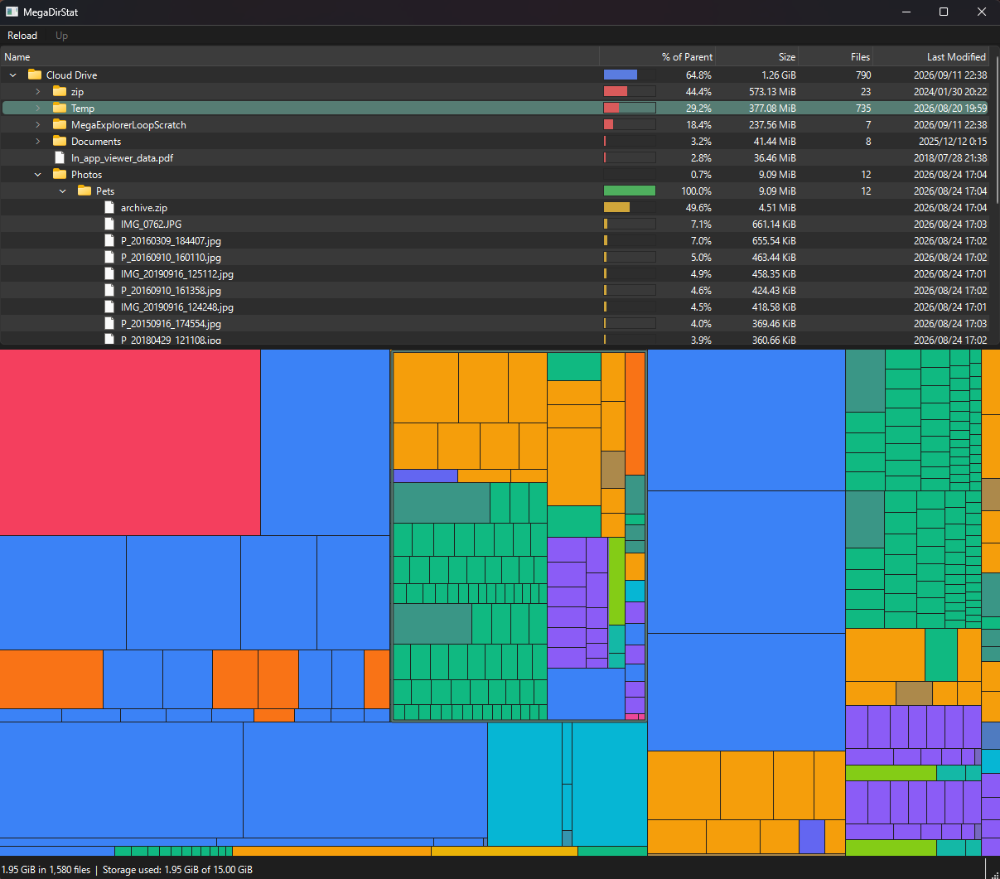

# MegaDirStat

[WinDirStat](https://windirstat.net) for [MEGA](https://mega.io) cloud storage. See what's taking up
the space in your MEGA account, as a folder tree on top and a treemap below.

- Folder tree sorted by size, with the share of the parent, file count and last modified
- Treemap coloured by file type, in sync with the tree
- Focus on one folder from the right-click menu, and go back up with the breadcrumb
- Read-only: it never changes anything in your account



**Note:** A small personal project, not affiliated with MEGA Limited, and with no warranty (see
[LICENSE](LICENSE)). It's only been tried on Windows. There's no release yet, so you'll need to build
it yourself.

You sign in every time you start it. The session is never saved, and the MEGA SDK's cache in
`%LOCALAPPDATA%\MegaDirStat\sdk-cache` is deleted when you quit.

## Build

Windows and the MSVC toolchain. The MEGA SDK's Windows build doesn't support MinGW.

- Visual Studio 2022, with "Desktop development with C++"
- Qt 6.8 or later, `msvc2022_64`
- CMake 3.21 or later. The copy shipped with Qt (`C:/Qt/Tools/CMake_64/bin/cmake.exe`) works.

```
git clone --recursive https://github.com/tackme31/MegaDirStat.git
cd MegaDirStat
third_party\vcpkg\bootstrap-vcpkg.bat
cmake --preset msvc-debug
cmake --build --preset msvc-release
```

The first configure builds the MEGA SDK's dependencies through vcpkg and takes a while. The binary
lands in `build/msvc-debug/Release/MegaDirStat.exe`, and needs Qt's `bin` on `PATH` to run
(`scripts\run.ps1` does that for you).

`CMakePresets.json` expects Qt at `C:/Qt/6.11.1/msvc2022_64`, so edit `CMAKE_PREFIX_PATH` there if
yours is somewhere else.

To try it without a MEGA account, start it on generated data:

```
MegaDirStat.exe --mock-generate 20000
```

## Author

Takumi Yamada ([@tackme31](https://github.com/tackme31))

## License

MegaDirStat is released under the [MIT License](LICENSE).

It links against Qt (LGPLv3) and the MEGA SDK (BSD-2-Clause), under their own terms.
